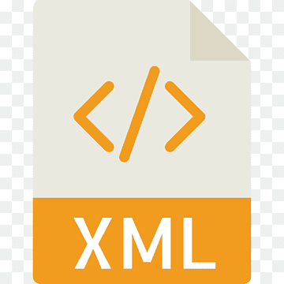

## Hi there, I'm Alex 👋

### 🎓  I’m currently a final year computer science student 

- 👯  I’m looking to add more content to my github 
- 🥅  2021 Goals: Create my own website 
- ⚡  Fun fact: I love to keep fit and read

---

### 📕 Current languages learning..

---

### Connect with me:

[][linkedin]
[]

 

[linkedin]: https://www.linkedin.com/in/ajscottleicester
[gmail]: https://www.linkedin.com/in/ajscottleicester
